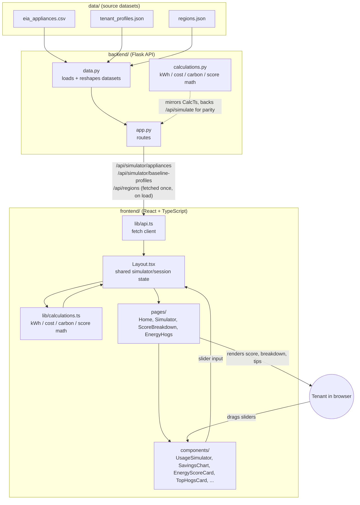

# Architecture

How the pieces fit together.

---

## System Overview

---

## How data actually flows

1. **On page load**, the frontend calls three read-only endpoints once — `/api/simulator/appliances`, `/api/simulator/baseline-profiles`, and `/api/regions` — via `lib/api.ts`. These are backed by `backend/data.py`, which loads and reshapes the three files in `data/`.
2. **Every slider drag after that is computed entirely client-side.** `Layout.tsx` holds the current hours-per-appliance state; `frontend/src/lib/calculations.ts` recomputes kWh, cost, carbon, score, and top energy hogs instantly, with no network round-trip. That's what makes the simulator feel live.
3. **`backend/calculations.py` mirrors `calculations.ts` line-for-line**, backing a standalone `/api/simulate` endpoint. The live UI doesn't call it — it exists so a non-JS caller (or the backend itself) can get identical numbers to what the frontend computes, and so the Python and TypeScript math stay provably in sync.
4. **Pages** (`Home`, `Simulator`, `ScoreBreakdown`, `EnergyHogs`) all read from the same shared context `Layout.tsx` provides, rather than each fetching or computing independently.
